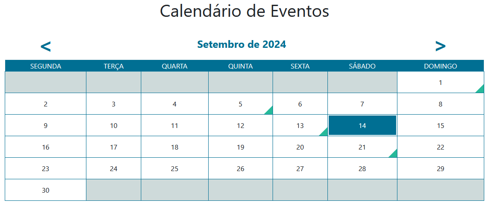

# Calendário de Eventos

Um script PHP simples para buscar detalhes de eventos de um banco de dados e exibi-los em um calendário usando Bootstrap 4, jQuery, Ajax e MySQL.

## Descrição
Os recursos incluídos são:
- Conexão ao banco de dados para recuperar eventos
- Botões de navegação clicáveis para exibir o mês anterior e o próximo sem atualizar a página (olha aí Ajax atuando!)
- Destaque da data atual
- Destaque dos dias com evento
- Criação de janelas modais Bootstrap para cada evento para conter detalhes do evento, como tópico, local e horário de início/término
- Célula clicável com um evento para exibir a caixa de diálogo modal relacionada
- Exibição de mensagens de erro

## Como usar
- Configurando banco de dados:
  - Crie o banco de dados (exemplo: "eventos_db") e depois crie uma tabela para conter os registros de eventos
  ```SQL
  CREATE TABLE `eventos` (
  `id_evento` int(11) NOT NULL,
  `titulo` varchar(200) NOT NULL,
  `objetivo` text CHARACTER SET utf8 COLLATE utf8_unicode_ci NOT NULL,
  `local` varchar(200) NOT NULL,
  `data` date NOT NULL,
  `horario` time NOT NULL,
  `usuario` varchar(50) NOT NULL,
  `dt_info` date NOT NULL,
  `status` varchar(50) NOT NULL
) ENGINE=InnoDB DEFAULT CHARSET=latin1 COLLATE=latin1_swedish_ci;
  ```
  - Adicione alguns dados de amostra:
  ```SQL
  INSERT INTO `eventos` (`id_evento`, `titulo`, `objetivo`, `local`, `data`, `horario`, `usuario`, `dt_info`, `status`) VALUES
(26, 'Entrega de Prestações de Contas - Agosto/2023', 'Prazos para Entrega de Prestações de Contas Municipais https://www.tcepi.tc.br/fiscalizado/prazos-municipais/', 'TCE/PI', '2024-09-13', '13:00:00', 'Donizete', '2023-01-27', 'pendente'),
(27, 'Entrega de Prestações de Contas - Setembro/2023', 'Prazos para Entrega de Prestações de Contas Municipais https://www.tcepi.tc.br/fiscalizado/prazos-municipais/', 'TCE/PI', '2024-09-01', '13:00:00', 'Donizete', '2023-01-27', 'pendente'),
(28, 'Entrega de Prestações de Contas - Outubro/2023', 'Prazos para Entrega de Prestações de Contas Municipais https://www.tcepi.tc.br/fiscalizado/prazos-municipais/', 'TCE/PI', '2024-01-01', '13:00:00', 'Donizete', '2023-01-27', 'pendente'),
(29, 'Entrega de Prestações de Contas - Novembro/2023', 'Prazos para Entrega de Prestações de Contas Municipais https://www.tcepi.tc.br/fiscalizado/prazos-municipais/', 'TCE/PI', '2024-01-30', '13:00:00', 'Donizete', '2023-01-27', 'pendente'),
(30, 'Entrega de Prestações de Contas - Dezembro/2023', 'Prazos para Entrega de Prestações de Contas Municipais https://www.tcepi.tc.br/fiscalizado/prazos-municipais/', 'TCE/PI', '2024-03-01', '13:00:00', 'Donizete', '2023-01-27', 'pendente'),
(41, 'Reunião Ordinária da Câmara', 'Sessão Ordinária da Câmara de Vereadores.', 'Plenário da Câmara', '2024-10-24', '09:00:00', 'Donizete', '2023-04-17', 'pendente'),
(42, 'Reunião Ordinária da Câmara', 'Sessão Ordinária da Câmara de Vereadores.', 'Plenário da Câmara', '2024-11-07', '09:00:00', 'Donizete', '2023-04-17', 'pendente'),
(43, 'Reunião Ordinária da Câmara', 'Sessão Ordinária da Câmara de Vereadores.', 'Plenário da Câmara', '2023-11-21', '09:00:00', 'Donizete', '2023-04-17', 'pendente'),
(44, 'Reunião Ordinária da Câmara', 'Sessão Ordinária da Câmara de Vereadores.', 'Plenário da Câmara', '2024-09-05', '09:00:00', 'Donizete', '2023-04-17', 'pendente'),
(45, 'Reunião Ordinária da Câmara', 'Sessão Ordinária da Câmara de Vereadores.', 'Plenário da Câmara', '2023-12-19', '09:00:00', 'Donizete', '2023-04-17', 'pendente'),
(62, 'Palestra TRANSFORMENTES 1.0', 'Treinamento com Certificação Digital, ministrado pelo Prof. Hipólito, um dos maiores especialista em neurocomunicação do país. Início do Evento 8:00 horas e duração de 6 horas.', 'Plenário da Câmara Municipal', '2024-09-21', '08:00:00', 'Donizete', '2023-10-05', 'pendente');
  ```
  - Defina a coluna `id` como chave primária:
  ```SQL
ALTER TABLE `eventos`
ADD PRIMARY KEY (`id_evento`);
  ```
  - Defina o autoincremento em `id`
  ```SQL
ALTER TABLE `eventos`
MODIFY `id_evento` int(11) NOT NULL AUTO_INCREMENT, AUTO_INCREMENT=63;
COMMIT;
  ```
- Abra `conecta.php` e configure os detalhes da conexão com seu banco de dados na **linha 6**;
- Crie uma página de teste (exemplo: `index.php`) para chamar o arquivo `calendario.php`:
  - Inclua referências de Bootstrap 4 CSS e JS, jQuery;
  - Inclua a referência do script `calendario.js`;
- Aplique CSS no calendário para obter melhores recursos visuais, se necessário:
  - Use o seletor `#calendar` para estilizar o contêiner do calendário
  - Use o seletor `#calendar .prev` ou `#calendar .next` para estilizar os botões de seta
  - Use o seletor `#calendar .calendar-day-names-header` para estilizar o cabeçalho com nomes de dias
  - Use o seletor `#calendar .calendar-days td` para estilizar as células (dias)
  - Use os seletores `#calendar .eventday`, `#calendar .today`, `#calendar .emptyday` para estilizar respectivamente as células com dias com eventos, a célula com o dia de hoje e as células que estão vazias
- Adicione uma imagem e/ou um mapa alterando o código na **linha 176** e na **linha 177** em `calendario.php`
